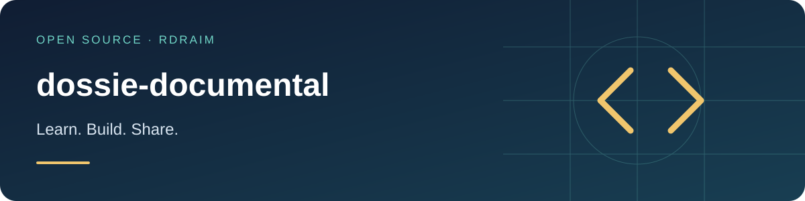

<p align="right">
  <a href="README.md"></a>
  <a href="README.en-US.md"></a>
  <a href="README.es-AR.md"></a>
</p>

# dossie-documental



<!-- public-badges:start -->
[](LICENSE) [](https://github.com/Rdraim/dossie-documental/actions) [](https://github.com/Rdraim/dossie-documental/releases) [](https://github.com/Rdraim/dossie-documental/commits/main)
<!-- public-badges:end -->

<p>
  <a href="https://github.com/Rdraim/dossie-documental/tree/main/examples"></a>
  <a href="https://github.dev/Rdraim/dossie-documental"></a>
  <a href="https://github.com/Rdraim/dossie-documental/archive/refs/heads/main.zip"></a>
</p>


Track document revisions and expiration without overwriting history.

## Installation

```bash
git clone https://github.com/Rdraim/dossie-documental.git
cd dossie-documental
npm test
node examples/basic.mjs
```

## Runnable example

```js
import {registrarRevisao, pendencias} from './src/index.js';
console.log(pendencias(registrarRevisao([],{id:'documento-A',referencia:'revisao-1',registradoEm:'2026-01-01',venceEm:'2026-02-01'}),'2026-01-15'));
```

## API

`registrarRevisao(history, {id, referencia, registradoEm, venceEm?})` returns a new list. Dates use UTC YYYY-MM-DD. `pendencias(history, today, {diasAlerta:30})` selects the latest revision and returns days and status.

## Limits

Metadata only; no file storage, signature verification or legal validity decisions. The consumer supplies persistence, approval and identity auditing.

## Compatibility

No runtime dependencies in the core. CI targets Node.js 22 and 24. Install from Git; this project is not published on npm. Review Releases and pin a tag/commit for integration. Dependency updates require license, engine and consumer test review. A CI badge is not a security certification.

[Compatibility](COMPATIBILITY.en-US.md) · [Contributing](CONTRIBUTING.en-US.md) · [Security](SECURITY.en-US.md)

MIT © Rodrigo Rodrigues

## ☕ Buy me a coffee

Did this project help you solve a problem, learn something new, or take your first steps in development? If you feel like supporting my work, a coffee is a kind way to say thank you.

I’m **Rodrigo Rodrigues**, creator of **Nexus** and these open source projects. Your support helps me set aside time to improve the code, write clearer examples, and keep sharing what I learn.

**Give any amount that feels right to you. Supporting is completely optional — the project remains free under the MIT license.**

<p>
  <a href="#support-via-pix"></a>
  <a href="https://github.com/techrodrigo21-ux/dossie-documental/issues/new?title=Feedback%3A%20this%20project%20helped%20me"></a>
</p>

### Support via Pix

In your banking app, scan the QR code or copy the Pix key below. Choose your amount and check the recipient details before confirming.

<p align="center">
  
</p>

**Pix key**

```text
8875a24e-44d1-4c91-b6bb-62c9f0070955
```

Pix is Brazil’s payment system. If your bank does not support it, you can still help by sharing the project, reporting a bug, improving the documentation, or leaving feedback.

### Your feedback matters, too

[Tell me how the project helped you](https://github.com/techrodrigo21-ux/dossie-documental/issues/new?title=Feedback%3A%20this%20project%20helped%20me). I’d love to hear what you built, what you learned, and what could be clearer for someone just starting out.

A comment is welcome with or without a donation. Please keep payment receipts, personal details, credentials and private user data out of public Issues.

---

**Thank you for supporting my work and helping me keep building and sharing. ❤️**
